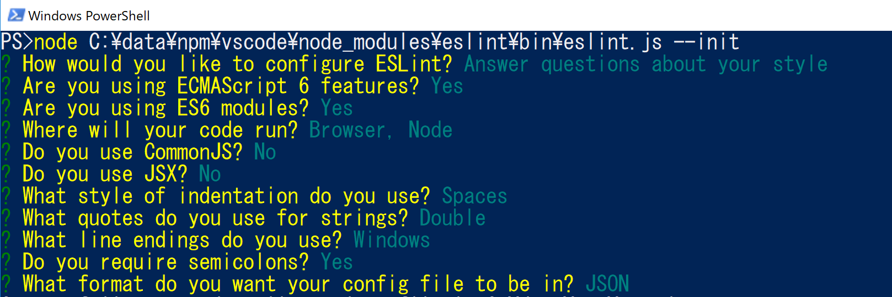
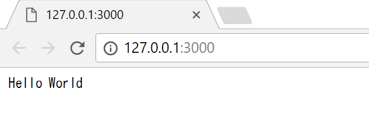
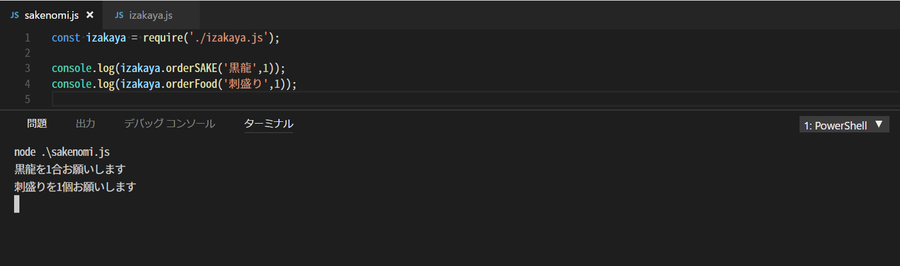

# 🔰Node.jsをさわってみた

## 🔰Node.jsとはなんぞや

とりえあず、Node.jsについてネット上の説明を色々とさらってまとめると下記のような理解を得ました。

- JavaScriptは元々ブラウザ用の言語。
- JavaScriptはNetscapeやらIEやら熾烈なブラウザ戦争の末に、ECMAというスイス・ジュネーブの標準化機関に標準化を託されたがそこでもまた色々ゴタゴタして混沌とした歴史を歩んでいる感じ。
- そんなJavaScriptですがブラウザ上だけではなくServerSideとかブラウザ以外の場面もJavaScriptでやりたいし作りたい!　という意見が出てくる。
- ブラウザ上での動作しか考えられていないJavaScriptには普通の言語なら持っている言語仕様が色々と足りてないので……この状況で色々とやろうとするとてもつらい。
- JavaScriptで色々とやるのはつらい -> じゃあランタイムで拡張しましょうと、様々な独自拡張が勃興してきた。
- 色々と乱立して混沌としてきたのでServerSideだけでもと標準仕様が望まれ、ServerJSが発足。後により広範囲を対象としたCommonJSが策定される。
- CommonJSが策定されると準拠した実装が色々とでてくる。
- その中の一つがNode.js。（ただしある時期からNode.jsはCommonJSの仕様を気にせず自由にやるようになったらしい）
- インターネット利用が広がってきてC10k 問題（クライアントアクセスが多すぎな時に発生する問題）を考慮する必要がでてくる。
- 何とかするために非同期処理やらライブラリなどが開発されたり、それを利用したソフトウェア等が出てきたりする。
- そんな中、Node.jsはgoogle V8 JavaScript Engine(googleが提供するJavaScript実行エンジン)やライブラリを組み合わせてeventloop + non-blocking I/O + JavaScriptな仕組みとして誕生。
- Node.jsは人気が出た末に、色々な人が便利なパッケージを作り公開。またパッケージの流行り廃りも激しい感じ。
- 今時のNode.jsバージョンでは標準でパッケージ管理ツールnpm(node package manager)が同梱されてる。
- 元々Node.jsにはWindows版は存在しなかったらが、ある時からWindwos版が追加された。

箇条書きになりましたが、Node.jsとJavaScriptの関係。Node.jsがJavaScript + Non-blockingな仕組みとして実装されてきた背景はざっくりとこんな感じのようです。

## 🔰Node.js関連のドキュメント

- [Node.js公式のドキュメント](https://nodejs.org/ja/docs/)

- [VSCodeのNode.jsチュートリアル](https://code.visualstudio.com/docs/nodejs/nodejs-tutorial)

## 🔰JavaScript関連のドキュメント

- [MDN JavaScript](https://developer.mozilla.org/ja/docs/Web/JavaScript)

MDN(Mozilla Developer Network)のJavaScriptドキュメントが綺麗にまとまってて見やすい。

## 🔰環境構築

今回はNode.js + Windows + VSCodeで色々と試してみる。

利用したバージョンについては下記になります。

- windows 10
- Node.js v9.3.0
- VSCode v1.19.1

### 🔰Node.jsのインストール

- [Node.js - ダウンロード](https://nodejs.org/ja/download/)からダウンロードしてインストール
- [chocolatey](https://chocolatey.org/)でインストール

お好きな方法でインストールして下さい。

[chocolatey](https://chocolatey.org/)はWindowsで利用できるパッケージ管理ソフト

### 🔰VSCodeのインストール

- [VSCode](https://code.visualstudio.com/)からダウンロードしてインストール

#### 🔰VSCodeの拡張機能インストール(Not Required)

VSCodeでNode.jsを利用するのに色々と纏まった拡張機能パックが目についたのでインストールしてみる。

Node.jsを利用するのにインストールが必須という訳ではないので必要なければ飛ばして下さい。便利そうなのでとりあえずインストールしてみる位の心持ち。

[Node.js Extension Pack](https://marketplace.visualstudio.com/items?itemName=waderyan.nodejs-extension-pack)

▶Node.js Extension Packの機能には下記の拡張機能がincludeされているようです。  


各拡張機能へのリンク

- [ESLint](https://marketplace.visualstudio.com/items?itemName=dbaeumer.vscode-eslint)
- [npm(npm support for VS Code)](https://marketplace.visualstudio.com/items?itemName=eg2.vscode-npm-script)
- [JavaScript (ES6) code snippets](https://marketplace.visualstudio.com/items?itemName=xabikos.JavaScriptSnippets)
- [Search node_modules](https://marketplace.visualstudio.com/items?itemName=jasonnutter.search-node-modules)
- [npm Intellisense](https://marketplace.visualstudio.com/items?itemName=christian-kohler.npm-intellisense)
- [Path Intellisense](https://marketplace.visualstudio.com/items?itemName=christian-kohler.path-intellisense)

それぞれ下記のような事ができる拡張機能のようです。

extensionName                  | description
------------------------------ | ---------------------------------------------------------------------------------------------------
ESLint                         | VSCodeでESLintを利用できるようにする拡張機能。ESLintはJavaScriptのLinter。
npm(npm support for VS Code)   | package.jsonというファイルに定義された情報を元にnpmモジュールを管理したり、スクリプトを実行したり。
JavaScript (ES6) code snippets | VSCodeでES6のスニペットが利用できる拡張機能
Search node_modules            | VSCodeでnpmのモジュール検索が利用できる拡張機能
npm Intellisense               | VSCodeでnpmのインテリセンスが利用できる拡張機能
Path Intellisense              | VSCodeでpath入力時にインテリセンスが利用できる拡張機能

ESLintは拡張機能をインストールしただけでは機能しない（npmモジュールのインストールも必要）ようなので下記で設定していく。

#### 🔰ESLintのインストール

ESLintはJavaScript（ECMAScript）の静的解析ツール。

[marketplace - ESLint](https://marketplace.visualstudio.com/items?itemName=dbaeumer.vscode-eslint)のページを見るとESLintのnpmモジュールをローカル。もしくはグローバルでインストールして設定しろと書いてあるのでやっていく。

#### 🔰npm(Node Package Manage)？

上の方で少し出てきましたが、npmはNode.js標準のパッケージマネージャ。(元々は標準じゃなかった？　みたいですが、あるときから標準で同梱されるようになったようです)

[npm](https://www.npmjs.com/)

今回インストールするのはESLintのパッケージ。

[npm - ESLint](https://www.npmjs.com/package/eslint)

▶npmのESLintのページ  


上記ページにも記載があるように、npmでモジュールをインストールする場合には大きく分けてふたつのインストール方法があります。

- ローカルインストール -> カレンドディレクトリにnode_modulesを作成してインストール
- グローバルインストール -> npmのグローバルな領域にインストール

グローバルインストールだと、その名の通りグローバルな領域にインストールするのでパスを気にしないでよいというメリットもあるみたいですが。基本的にはローカルインストールしておけば良いような気がします。

個人的な意見ですがグローバルインストールだと、名前の通りグローバルなんでパスを気にせず実行できるのは便利ですが、パッケージを無秩序に入れまくると何がなんだか分からなくなるので。

適切な単位でディレクトリを切り、ローカルな環境に必要なパッケージを都度都度インストールしていくのが良さそうな気がしています。

という訳でここではローカルインストールでESLintをインストールしていきます。

#### 🔰npmでESLintをローカルインストール

今回は、powershellのコンソールからnpmを実行して`c:\data\npm\vscode`というディレクトリにESLintをインストールしてみます。

まずはインストール先のディレクトリを作成して、カレントディレクトリを移して、`npm init`を実行。
`npm init`はnpmモジュールを管理するpackage.jsonファイルを対話式で作成してくれるコマンド。
いきなり、npm installコマンドを叩いてもインストールできますが、せっかくなので`npm init`から実行してみる。

```Powershell
mkdir c:\data\npm\vscode

cd c:\data\npm\vscode

npm init

```

▶`npm init`を実行すると下記のように色々と対話式で聞かれますが、とりあえずデフォルトで作成してみます。全部Enter!  


▶package.jsonファイルが作成されました。  


下記コマンドでESlintをローカルインストールします。`--save-devはpackage.json`にインストールしたパッケージの情報を自動で書き込んでくれるパラメータになります。

```Powershell
npm install eslint --save-dev
```

▶ローカルインストール完了  
(`npm init`でpackage.jsonを生成する時に、descriptionとか指定しなかったから？　警告が出てますね……)  


▶node_modulesというフォルダが作成されて、ESLintと依存関係のあるパッケージがインストールされます。  


▶パラメータで`--save-dev`を指定したのでpackage.jsonを見てみるとインストールしたパッケージの情報が記載されている事がわかります。  
(devDependenciesにインストールされたモジュールとバージョンが記載されていることがわかる)  


#### 🔰ESLintの設定ファイルを作成する

ESLintはインストールしただけで利用可能なわけでは無くて、ESLintで静的解析をする際のコンフィグファイルが必要となります。
一から全部記述するのは現実的ではないので、コンフィグファイルのテンプレートを生成して、それをカスタマイズします。

```Powershell
node C:\data\npm\vscode\node_modules\eslint\bin\eslint.js --init
```

▶実行すると対話式で条件を聞いてくるので今回は下記のように入力してみた。  


▶.eslintrc.jsonというファイルがカレントディレクトリに作成されました。  


#### 🔰VSCodeの設定ファイルにESLintのインストールパスをコンフィグファイルのパスを設定する

VSCodeでESLintを利用するには、VSCodeの設定ファイル(settings.json)にESLintのインストールパスとコンフィグファイルのパスを設定する必要があります。

▶VSCodeの基本設定->設定から下記のパラメータを探して追加する。  


- eslint.nodePath
- eslint.options

#### 🔰適当なjsファイルを書いてESLintの動作を確認

testESLint.jsというサンプル用のファイルを作成してESLintが動作していることを確認する。

下記のようにインデントがおかしい　＆　セミコロン忘れ　な感じでコーディングしたサンプルを用意する。

```javascript
// testESLint.js
// ESLintのチェック用にインデントとセミコロンが誤っている記述
let firstStep = 'HelloWorld';

    console.log(firstStep)
```

▶コーディングするたびに逐次チェックされて問題パネルに下記のようにチェック結果が表示される。  


▶ちなみにVSCodeのコマンドパレット(ctrl+shift+p)から`ESLint: Fix all auto-fixble problems`を実行すると、指摘された問題で直せる所は自動で直してくれます。  


## 🔰コンソールログにHelloWorldと表示してみる

ここではconsoleHelloworld.jsというファイルを作成して、コンソールにhelloWorldと表示してみる。

[console.log](https://nodejs.org/dist/latest-v9.x/docs/api/console.html#console_console_log_data_args)

```javascript
// consoleHelloworld.js
// HelloWorld
console.log('HelloWorld');
```

consoleHelloworld.jsというファイルを作成したら、コマンドから実行する。
node.exeの後に引数として作成したスクリプトを指定して実行すると、スクリプトが実行されてhelloworldとコンソールに表示されます。

```powershell
node ./consoleHelloworld.js
```

▶スクリプトを実行するとコンソールにhelloworldと表示される。  


## 🔰Node.jsの公式ドキュメントに書いてあるhelloworldをやってみる。

[An example of a web server written with Node.js which responds with 'Hello World':](https://nodejs.org/dist/latest-v8.x/docs/api/synopsis.html)

Node.jsは手軽にnon-blockingでwebな環境を提供しているので、公式サイトに記載されているhelloworldのサンプルはhelloworldと返すhttpサーバを立てるサンプルになっている。

こちらを試してみる。

```javascript
// exsample.js
const http = require('http');

const hostname = '127.0.0.1';
const port = 3000;

const server = http.createServer((req, res) => {
    res.statusCode = 200;
    res.setHeader('Content-Type', 'text/plain');
    res.end('Hello World\n');
});

server.listen(port, hostname, () => {
    console.log(`Server running at http://${hostname}:${port}/`);
});

```

上記コードをexample.jsに保存。

```powershell
node example.js
```

▶上記のような感じで、nodeの後に作成したjsファイルをpowershellで指定して実行。  


▶`Server running at http://127.0.0.1:3000/`と表示されているのでブラウザでアクセスしてみる。  


Hello Worldと表示されました。

ちなみに127.0.0.1はローカル・ループバック・アドレスという自分自身指す特別なIPアドレス。
また立ち上がったhttpサーバはコンソールを閉じるか、`ctrl + c`で止めるまで動き続けてます。

## 🔰function(関数)

ここではfunction機能を試してみる。

前回まではVSCodeで下記コードを書いて保存して、node …….jsという感じで処理を実行させていましたが。
ここからはVSCodeの統合ターミナル(ctrl+@)から実行してみます。

ここではsampleCodeFunction.jsというファイルを作成して実行していく。

```javascript
// sampleCodeFunction.js
// functionを定義
function drinkKIKUSUIKAN() {
    console.log('菊水缶ごくごく');
}

// 定義したdrinkKIKUSUIKANを実行
drinkKIKUSUIKAN();

// 引数を持ったfunctionを定義
function drinkSAKE(sake) {
    console.log(sake + 'はうまい');
}

// functionに引数を渡して実行
drinkSAKE('菊正宗');

// functionExpression。 関数は式で代入が出来たりもする
let drinkSAKEObject = function (sake) {
    console.log(sake + 'ごくごく');
};

drinkSAKEObject('剣菱');

// 関数を呼ぶ関数を書いてみる
function callFunction(functionName,arg) {
    functionName(arg);
}

// allowfunctionを使ってみる
let eatSnack = (otsumami) => {console.log(otsumami + 'もぐもぐ')}

eatSnack('白子ポン酢');

callFunction(drinkKIKUSUIKAN,null);
callFunction(drinkSAKE,'浜福鶴');

```

▶VSCodeでコーディングして、統合ターミナルから実行してみる。  
functionを定義したり、functionを代入したり、functionを呼ぶfunctionを書いてみたり、allowfunctionだったり動作していることが確認できる。  


## 🔰Global Objectをさわってみる

下記のページに記載のあるグローバルオブジェクトをいくつか利用してみる。
globalsのページで説明されているが一部のオブジェクトはグローバルではないそうです。

[Node - Globals](https://nodejs.org/api/globals.html)

今回はsampleCodeGlobals.jsというファイルを作成して幾つかのグローバルオブジェクトをさわってみる。

```javascript
// sampleCodeGlobals.js
// __dirname
// 現在実行中モジュールのカレントディレクトリ名を表示
console.log(__dirname);

//  __filename
// 現在実行中モジュールのファイル名（フルパス）を表示
console.log(__filename);

// setImmediate(callback[, ...args])#
// callbackのところのにfunctionを指定するとfunctionを即時実行してくれる
setImmediate(
    function () {
        console.log('hello:Immediate');
    }
);

// setInterval(callback, delay[, ...args])#
// callbackのところのにfunctionを指定すると指定した時間でInterval実行される
// そのままだと無限ループになるので、止める場合はclearIntervalで止める
let counter = 0;
let timer = setInterval(
    function () {
        console.log('hello:Interval');
        if (counter > 5) {
            clearInterval(timer);
        }
        counter += counter + 1;
    }, 3000);

// setTimeout(callback, delay[, ...args])
// callbackのところのにfunctionを指定すると指定した時間経過後に実行される
setTimeout(function () {
    console.log('hello:Timeout');
}, 1000);

```

▶Globalオブジェクトなサンプルプログラムの実行結果  


今回、sampleCodeGlobals.jsを`c:\tutorialCode\Node.js`に配置したので下記のようにコンソールに結果表示されている。

- カレントディレクトリ（__dirname）は`c:\tutorialCode\Node.js`
- ファイル名（__filename）は`c:\tutorialCode\Node.js\sampleCodeGlobals.js`

setInterval->setTimeoutの順番で処理を実行しているがコンソールにはsetTimeoutのcallbackの結果が先に実行されている。

これはsetTimeoutもsetIntervalも指定時間待つ処理を行うが、blockingするわけではなくnon-blockingであり後続の処理が順次行われていることが解るかと思います。

## 🔰Modulesをさわってみる

[Node - Modules](https://nodejs.org/api/modules.html)

ここではsakenomi.jsとizakaya.jsを作成してrequireの動きとmodule.exportsの動きを確かめてみる。

下記のようなファイルを作成して同じディレクトリに格納する。

```javascript
// sakenomi.js
const izakaya = require('./izakaya.js');

console.log(izakaya.orderSAKE('黒龍',1));
console.log(izakaya.orderFood('刺盛り',1));
```

```javascript
// izakaya.js
let orderSAKE = function(SAKE,unit){
    return (SAKE + 'を' + unit + '合お願いします');
};

let orderFood = function(Food,unit){
    return (Food + 'を' + unit + '個お願いします');
};

module.exports.orderSAKE = orderSAKE;
module.exports.orderFood = orderFood;

```

▶modulesのサンプルコードの実行結果  


sakenomi.jsはrequireでizakaya.jsを読み込んでfunction orderSAKEとorderFoodを実行します。
izakaya.jsはfunction ordersakeとorderFoodを定義していて、module.exportsで外部から参照出来るように設定しています。

## 🔰Eventsをさわってみる

[Node - Events](https://nodejs.org/api/events.html)

Node.jsだとイベント駆動な処理を行いやすいように標準でeventsというモジュールが用意されている。

eventsモジュールのEventEmitterクラスを利用するとイベントという単位で処理を登録したり、その登録したイベントを発火したりとイベント操作を行うことが出来る。

ここではsampleCodeEvents.jsを作成してeventsの機能を試してみる。

```javascript
// sampleCodeEvents.js
// eventsモジュールの読み込み
let events = require('events');

// EventEmitterをmyEmitterにインスタンス化
let myEmitter = new events.EventEmitter();

// onでorderイベントの登録
// emitter.on(eventName, listener)
myEmitter.on('order', function (msg) {
    console.log('order:on:'+msg);
});

// onceでorderイベントの登録 onとは違いonceは一度だけ実行される
// emitter.once(eventName, listener)
myEmitter.once('order', function (msg) {
    console.log('order.once:'+msg);
});

// onでdoneイベントの登録
// emitter.on(eventName, listener)
myEmitter.on('done', function (msg) {
    console.log('done:on:'+msg);
});

// onceでdoneイベントの登録 onとは違いonceは一度だけ実行される
// emitter.once(eventName, listener)
myEmitter.once('done', function (msg) {
    console.log('done.once:'+msg);
});

myEmitter.emit('order', 'order発火1回目');
myEmitter.emit('order', 'order発火2回目');
myEmitter.emit('order', 'order発火3回目');
myEmitter.emit('done', 'done発火1回目');
myEmitter.emit('done', 'done発火2回目');
myEmitter.emit('done', 'done発火3回目');

```

▶eventsのサンプルコードの実行結果  


EventEmitterのonとonceで登録を行い、emitで発火を行います。
onとonceの違いとしては、

- onceは一度だけ実行されるイベントハンドラの登録。
- onは削除されるまで実行されるイベントハンドラの登録。

となっているようです。

## 🔰File Systemをさわってみる

[Node.js - File System](https://nodejs.org/api/fs.html)

ここではFileSystemモジュールをためしてみる。

### 🔰ファイルの読み書き

下記のwriteFileとappendFileとreadFileを利用して上書きと追記を試してみる。

- [fs.writeFile(file, data[, options], callback)](https://nodejs.org/api/fs.html#fs_fs_writefile_file_data_options_callback)
- [fs.appendFile(file, data[, options], callback)](https://nodejs.org/api/fs.html#fs_fs_appendfile_file_data_options_callback)
- [fs.readFile(path[, options], callback))](https://nodejs.org/api/fs.html#fs_fs_readfile_path_options_callback)

下記の例では非同期（書き込みや読み込みが完了するのを待たずに後続処理を行う）で実行しているので場合によっては、書き込み前に読み込みが走る可能性もあり。
同期で読み書きをする場合は下記を利用すれば出来るようです。

```javascript
// sampleCodeFileSystemIO.js
// FileSystemモジュールを利用してファイルの読み書き(非同期)
// FileSystemモジュールの読み込み
let fs = require('fs');

// 非同期でテキストファイルに書き込んでみる

// writeFileで対象に上書き保存
fs.writeFile('helloworld.txt', 'writeFile:helloworld\r\n', 'utf8', function (err) {
    if (err) {
        throw err;
    }
});

// appendFileで対象に追記で保存
fs.appendFile('helloworld.txt', 'appendFile:helloworld\r\n', 'utf8', function (err) {
    if (err) {
        throw err;
    }
});

// 非同期でテキストファイルを読み込んでみる

// readFileでhelloworld.txtファイルを読み込み
fs.readFile('helloworld.txt', 'utf8', function (err, data) {
    let readFile = data;
    console.log(readFile);
});

```

▶fileIOのサンプルコード実行結果  


- writeFileを実行して`writeFile:helloworld\r\n`で既存テキストに上書き保存。
- appendFileを実行して`appendFile:helloworld\r\n`で既存テキストに追記して保存。
- readFileを実行してテキストの読み込み。

上記実行結果だと何回か動かしているが、非同期で動かしているので、appendFileでファイルが書かれる前にreadFileが動いている場合があることが確認できる。
ちなみに同期で読み書きを行うには下記を利用すればOK。

- [fs.readFileSync(path[, options])](https://nodejs.org/api/fs.html#fs_fs_readfilesync_path_options)
- [fs.writeFileSync(file, data[, options])](https://nodejs.org/api/fs.html#fs_fs_writefilesync_file_data_options)
- [fs.appendFileSync(file, data[, options])](https://nodejs.org/api/fs.html#fs_fs_appendfilesync_file_data_options)

### 🔰ファイルの削除

ここではsampleCodeFileSystemDeleteFile.jsを作成して、ファイルの削除を試していきます。

[fs.unlink(path, callback)](https://nodejs.org/api/fs.html#fs_fs_unlink_path_callback)

```powershell
# powershellで削除するファイルを作成する。
# 適当にcurrentDirectoryにhelloworldと入力したテキストファイルを作成
New-Item -ItemType File -Path ./test.txt -Value helloworld
```

```javascript
// sampleCodeFileSystemDeleteFile.js
// FileSystemモジュールを利用してファイルの削除(非同期)

// FileSystemモジュールの読み込み
let fs = require('fs');

// 非同期でファイルを削除してみる

// unlinkで対象を削除
fs.unlink('test.txt', function (err) {
    if (err) {
        throw err;
    }
});

```

▶ファイル削除のサンプルコード実行結果  


### 🔰ディレクトリの作成

ここではsampleCodeFileSystemMakeDir.jsを作成して、ディレクトリ作成してみます。

[fs.mkdir(path[, mode], callback)](https://nodejs.org/api/fs.html#fs_fs_mkdir_path_mode_callback)

```JavaScript
// sampleCodeFileSystemMakeDir.js
// FileSystemモジュールを利用してディレクトリの作成(非同期)

// FileSystemモジュールの読み込み
let fs = require('fs');

// 非同期でディレクトリを作成
fs.mkdir('newDirectory', function (err) {
    if (err) {
        throw err;
    }
});

```

▶ディレクトリを作成するサンプルコードの実行結果  


### 🔰ディレクトリの削除

ここではsampleCodeFileSystemRemoveDir.jsを作成して、ディレクトリ削除を試してみます。

[fs.rmdir(path, callback)](https://nodejs.org/api/fs.html#fs_fs_rmdir_path_callback)

```JavaScript
// sampleCodeFileSystemRemoveDir.js
// FileSystemモジュールを利用してディレクトリの削除(非同期)

// FileSystemモジュールの読み込み
let fs = require('fs');

// 非同期でディレクトリの削除
fs.rmdir('newDirectory', function (err) {
    if (err) {
        throw err;
    }
});

```

▶ディレクトリを削除するサンプルコードの実行結果  


## 🔰streamの操作

Node.jsに用意されているstreamについて。

[Node - Stream](https://nodejs.org/api/stream.html)

FileSystemオブジェクトの非同期でファイルのIOを上の方で試してみたが。
巨大なファイルを取り扱おうとした場合などでは、一般的に一度にファイルを読み込んで処理を行おうとすると色々と不都合が発生する場合があります。(メモリを大量に消費したり)

Node.jsではstreamが用意されており、全部を一度に処理するのではなく一定量ずつ読み込んで処理を行うことができます。

streamには下記のような種類があるようです。

- Readable Streams
- Writable Streams
- Duplex and Transform Streams

これらを利用したNode.jsの機能を幾つか動かしてstreamを試してみる。

### 🔰Readable Streamsをためしてみる

ここではReadable Streamsをためしてみる。

[Readable Streams](https://nodejs.org/api/stream.html#stream_readable_streams)

Readable Streamsと一口にいっても、ページを参照するとHTTPレスポンスだったり、ファイル読み込みだったり、データ圧縮だったり等々。標準機能でstream.Readableクラスを用いて実装された例が色々とでています。

この中ではFileSystemモジュールのfs.createReadStreamがとっつきやすそうなのでこれを動かしてReadableなStreamを試してみたいと思います。

[fs.createReadStream(path[, options])](https://nodejs.org/api/fs.html#fs_fs_createreadstream_path_options)

とりあえずPowershellで100万行のテキストファイル(UTF8)を用意。

```Powershell
#powershellでbom less utf8のファイルを作成する。
#なお実行環境がpowreshell 5.1のため小細工をしてbom less utf8を出力しています。
#powershell 6からはbom less utf8がデフォルトとなるためpowershell　6 環境ならば安直にout-fileでテキストファイル作れば良さそう。
1..1000000 | %{ $_.ToString("0000000") } | %{ [Text.Encoding]::UTF8.GetBytes("$_`r`n")} | Set-Content -Path .\Million.txt -Encoding Byte
```

0000001  
0000002  
0000003  
....  

というようなテキストファイルを生成します。

そしてsampleCodeReadable.jsというファイルを作成して、上記のテキストファイル読み込みます。

このプログラムはテキストファイルを9byte読み込む毎にHelloworldと出力するようなプログラムになります。
0000001(7byte)と改行コードcrlf(2byte)で一行9byteなので、一行読み込む毎にhelloworldと出力します。

```JavaScript
// sampleCodeReadable.js
// FileSystemモジュールを利用してファイルの読み込み(stream)
// FileSystemモジュールの読み込み
let fs = require('fs');

// 読み込みでエンコーディングはutf8で9byte毎に
const options = {
    flags: 'r',
    encoding: 'utf8',
    highWaterMark: 9
};

let myReadStream = fs.createReadStream('million.txt', options);

myReadStream.on('data', function (chunk) {
    console.log('helloworld');
    console.log(chunk);
});

```

▶readableのサンプルコード実行結果。  


### 🔰Writable Streamsをためしてみる

Writable Streamsについても、Readableと同じく標準機能で色々と利用したものがあるようですが、FileSystemモジュールのfs.createWriteStreamを利用して試してみたいと思います。

[fs.createWriteStream(path[, options])](https://nodejs.org/api/fs.html#fs_fs_createwritestream_path_options)

```JavaScript
// sampleCodeWritable.js
// FileSystemモジュールを利用してファイルの書き込み(stream)
// FileSystemモジュールの読み込み
let fs = require('fs');

// 書き込みでエンコーディングはutf8
const options = {
    flags: 'w',
    encoding: 'utf8'
};

let myWriteStream = fs.createWriteStream('writeStream.txt',options);

myWriteStream.write('hello,writeStream');

```

▶Writable Stramのサンプルコード実行結果  


実行結果といってもコレだけではよくわからない訳で、書き込んだwriteStream.txtを見てみます。

▶指定したテキストファイルに`hello,writeStream`という文字列が書き込まれている事が確認出来ます。  
これがストリームで書き込まれているらしい。  


### 🔰Duplex and Transform Streams

[Duplex and Transform Streams](https://nodejs.org/api/stream.html#stream_duplex_and_transform_streams)

- Duplex Streamsは読み書きが出来るストリーム
- Transform Streamsは読み書きが出来るストリームで入力データを変換して出力するストリーム

となっているようです。

Duplexを利用した例としてはTCP Socketsが該当し、transformを利用した例としてはzlib streamsが該当するようなのでコレをさわってみる。

#### 🔰Duplex Streams

[net.createConnection(path[, connectListener])](https://nodejs.org/api/net.html#net_net_createconnection_path_connectlistener)

TCPSocketsがDuplex Streamsで実装されているらしい。ここでは何となくそういう物もあるんだ位の理解。

`googe.co.jp`に接続して取得したhtmlを表示してcloseするサンプルプログラム。

```JavaScript
// sampleCodeTCPSocket.js
const net = require('net');
const client = net.createConnection({ host: 'google.co.jp', port: 80 }, () => {
    //'connect' listener
    console.log('connected to server!');
    client.write('world!\r\n');
});
client.on('data', (data) => {
    console.log(data.toString());
    client.end();
});
client.on('end', () => {
    console.log('disconnected from server');
});

```

#### 🔰Transform Streams

[zlib.createDeflate(options)](https://nodejs.org/api/zlib.html#zlib_zlib_createdeflate_options)

zlibがTransform Streamsで実装されている。

zlibはファイルを圧縮するモジュールで、入力されたデータを変換（圧縮）して出力することがわかる。

```JavaScript
// sampleCodeZlib.js
const zlib = require('zlib');
const gzip = zlib.createGzip();
const fs = require('fs');
const inp = fs.createReadStream('Million.txt');
const out = fs.createWriteStream('Million.txt.gz');

inp.pipe(gzip).pipe(out);
```

## 🔰pipes

[readable.pipe(destination[, options])](https://nodejs.org/api/stream.html#stream_readable_pipe_destination_options)

zlibの所でちらっと出てきたが、readable streamはpipeでつなぐことが出来る。

下記の例では、readable streamで読み込んだテキストファイルをpipeでwritable streamに繋いで出力しているサンプルプログラム。

```JavaScript
// sampleCodePipes.js
// FileSystemモジュールの読み込み
let fs = require('fs');

// オプジョン設定
const options = {
    flags: 'r',
    encoding: 'utf8',
};

let myReadStream = fs.createReadStream('million.txt', options);
let myWriteStream = fs.createWriteStream('pipe.txt');

// Readable streamをWritable streamにパイプでつなぐ
myReadStream.pipe(myWriteStream);

```

## 🔰httpモジュール

[Node - http](https://nodejs.org/api/http.html)

ここではNode.jsのドキュメントに記載されているHelloworldで少し出てきたhttpモジュールをもう少し触ってみる。

### 🔰HTMLページを配信してみる。

ここでは適当なindex.htmlファイルを用意してそれを配信するhttpサーバを立ててみる。

下記のサンプルコードindex.htmlとsampleCodeHTTPServing.jsを同ディレクトリに配置して実行して動きを確認してみる。

```index.html
<!DOCTYPE html>
<html>
<head>
    <meta charset="utf-8" />
    <title>hello,http module</title>
    <style>body{background: black;color:white}</style>
</head>
<body>
<p>hello,http module</p>
</body>
</html>

```

```JavaScript
// sampleCodeHTTPServing.js
// httpモジュールの読み込み
const http = require('http');
// fsモジュールの読み込み
const fs = require('fs');

const hostname = '127.0.0.1';
const port = 3000;

// createServer
const server = http.createServer((req, res) => {
    // レスポンスのステータスコード200 OK
    res.statusCode = 200;
    // レスポンスのコンテンツタイプ設定
    res.setHeader('Content-Type', 'text/html');
    // inde.htmlファイルをReadatble Streamで読み込む
    let myReadStream = fs.ReadStream( 'index.html', 'utf8');
    // 読み込んだindex.htmlファイルをパイプでレスポンスに渡す
    myReadStream.pipe(res);
});

// listenを開始
server.listen(port, hostname, () => {
    console.log(`Server running at http://${hostname}:${port}/`);
});

```

▶HTTPページの配信サンプルコードの実行結果  


▶`http://127.0.0.1:3000/`にブラウザでアクセスしてみる  


さっくりとhttpサーバが立ち上がってるのを見ると、おおおぅ！　って感じ。

### 🔰JSONを配信してみる

ここでは適当なjsonを配信するhttpサーバを立ててみる。

下記のサンプルコードを実行して動きを確認してみる。

```JavaScript
// sampleCodeJSONServing.js
// httpモジュールの読み込み
const http = require('http');

const hostname = '127.0.0.1';
const port = 3000;

// createServer
const server = http.createServer((req, res) => {
    // レスポンスのステータスコード200 OK
    res.statusCode = 200;
    // レスポンスのコンテンツタイプ設定
    res.setHeader('Content-Type', 'application/json');

    let myObj = {
        sake: '剣菱'
    };
    // JSON.stringifyでJSON文字列に変換してレスポンスに渡す
    res.end(JSON.stringify(myObj));

});

// listenを開始
server.listen(port, hostname, () => {
    console.log(`Server running at http://${hostname}:${port}/`);
});

```

▶JSONの配信サンプルコードの実行結果  


▶`http://127.0.0.1:3000/`にブラウザでアクセスしてみる  


▶開発者ツールでnetworkタブのHeadersを見てみる  


▶開発者ツールでnetworkタブのResponseを見てみる  


### 🔰ルーティング

ここではリクエストされたURLに対してルーティグするようなサンプルプログラムを作成してみる。

- リクエストされたURLのファイルが存在したら、該当ファイルを読み込みレスポンスに渡す & ステータス200.
- リクエストされたURLのファイルが存在しなければ、404.html読み込みレスポンスに渡す & ステータス404.
- リクエストされたURLの末尾が/の場合はindex.htmlを読み込み &　ステータス200。

```JavaScript
// sampleCodeRouting.js
// httpモジュールの読み込み
const http = require('http');
// fsモジュールの読み込み
const fs = require('fs');
// pathモジュールの読み込み
var path = require('path');

const hostname = '127.0.0.1';
const port = 3000;

// createServer
const server = http.createServer((req, res) => {

    // 末尾が/で終わってたら/index.htmlを指定
    let base = null;
    if (req.url.endsWith('/')) {
        base = '/index.html';
    } else {
        base = decodeURI(req.url);
    }

    // フルネームを設定
    let fullName = path.join(__dirname, base);

    // readable streamを設定
    let myReadStream = fs.createReadStream(fullName, 'utf8');

    // openイベントでファイルを開いた時にヘッダ書き込み
    myReadStream.on('open', () => {
        res.statusCode = 200;
        res.setHeader('Content-Type', 'text/html; charset=utf-8');
    });

    // dataイベントで読み込んだファイルをレスポンスにwrite
    myReadStream.on('data', (chunk) => {
        res.write(chunk, 'utf8');
    });

    // closeイベントでレスポンスにend
    myReadStream.on('close', () => {
        res.end();
    });

    // 指定されたファイルが無ければ404
    myReadStream.on('error', () => {
        res.statusCode = 404;
        res.setHeader('Content-Type', 'text/html; charset=utf-8');
        let myReadStream = fs.ReadStream('404.html', 'utf8');
        // 読み込んだindex.htmlファイルをパイプでレスポンスに渡す
        myReadStream.pipe(res);
    });

});

// listenを開始
server.listen(port, hostname, () => {
    console.log(`Server running at http://${hostname}:${port}/`);
});

```

▶ルーティングのサンプルコードの実行結果  


▶`http://127.0.0.1:3000/`にブラウザでアクセスしてみる  


▶sampleCodeRoutingと同ディレクトリに存在するファイルを指定してみる(writeStream.txt)  


▶存在しないファイルを指定してみる(404.htmlに飛ばされる)


上記のような感じでルーティングできる事が確認できる。

このサンプルプログラムだとminetypeがどのファイルを指定してもminetypeは`text/html`ですが。

## 🔰総評

とりあえず導入から標準モジュールを軽くさわって、httpサーバを立ててみる所までやってみた。

単純に動かしてみる分には、淡々と動かせる感じ。

JavaScriptとNode.jsの存在自体がなんなのかはとても取っ付き辛い所があるのとは対象的に動かすのは割りと楽。

この後は実際に何かしらのDBと連携させたり、webアプリを作ってみたりとかそういう感じになっていくのだろうけど、Node.jsってフレームワークやら流行り廃りが激しすぎて外から見てると何使ったら良いのかが良くわからない印象があります……
